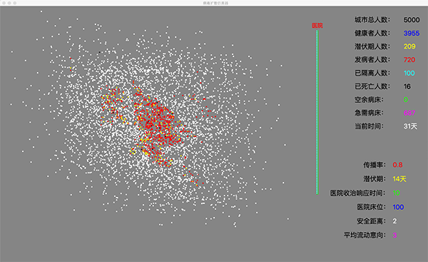
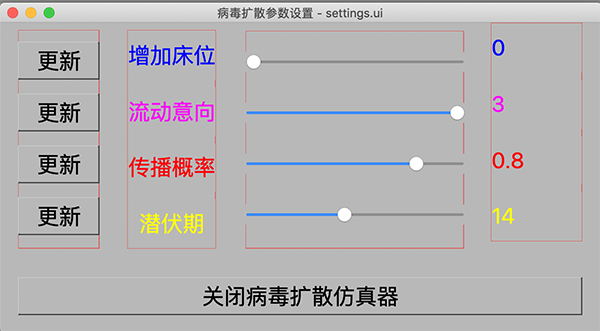

技术支持请关注"极客起源"公众号

《冠状病毒传播仿真器》可以实时模拟从病毒爆发到疫情结束的整个过程，可以通过参数设置在不同情况下疫情的最终结果，本项目使用Python、PyQt5以及多线程技术实现，并且使用了正态分布模拟人员分布以及人员运动轨迹。

使用PyCharm开发，pull后，直接用PyCharm打开即可。运行工程根目录的run.py可启动仿真器。运行settings中run.py可启动设置程序。

《冠状病毒传播仿真器》使用了Python语言和PyQt5技术，如果对这两种技术不了解的同学可以参考下面的课程

[Python从菜鸟到高手](https://ke.qq.com/course/390456?tuin=a22a65ce)

[PyQt5（Python）实战视频课程](https://ke.qq.com/course/374285?tuin=a22a65ce)

[冠状病毒传播仿真器（Python版本）](https://edu.51cto.com/sd/eee18)